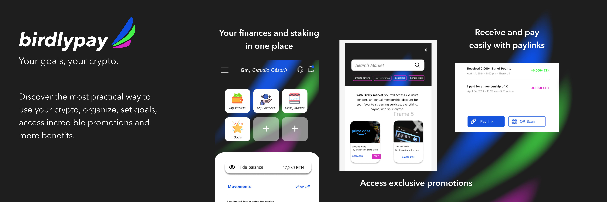

# OnChainSummer project: Birdlypay


Discover the most practical way to use crypto, organize, set goals, access incredible promotions and more benefits.

Create the enviroment file:
Go to /Birdlypay folder and run:

```bash
cp .env.example .env
```


Add the values for the follow variables:
```bash
NEXT_PUBLIC_THIRDWEB-CLIENT-ID=
NEXT_PUBLIC_THIRDWEB-SECRET-KEY=```
```


Run the App:

```bash
npm install --legacy-peer-deps
npm run dev
```


Contract Address - PaymentLink:

0xf3F7F05406d9F2B4EcB43Cc240bd6657bB6A8f7f


